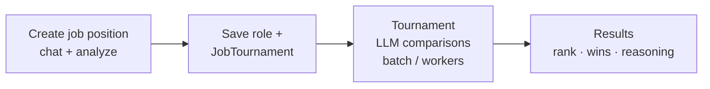

# Tyro

HR / recruitment monorepo — positions, AI-assisted drafting, CVs, Celery workers, OpenAI Batch jobs.

## Stack

- **`backend/`** — FastAPI, MongoDB (Beanie), Redis, Celery, LLM agents (LiteLLM)
- **`frontend/`** — React, TypeScript, Vite, Tailwind, shadcn/ui
- **`batch_manager/`** — OpenAI Batch JSONL pipeline, MinIO, scheduler
- **`infra/`** — shared config (e.g. LiteLLM)

**Run:** root `docker-compose.yml` · **Details:** [`CLAUDE.md`](./CLAUDE.md)

## Screenshots

  

  

  

- **Position** — overview + matched candidates table

## Flow

**TLDR:** comparisons → ranked candidates (`wins` / `rank` / `reasoning`). Heavy runs → JSONL chunks → MinIO → OpenAI Batch → scheduler until done.
