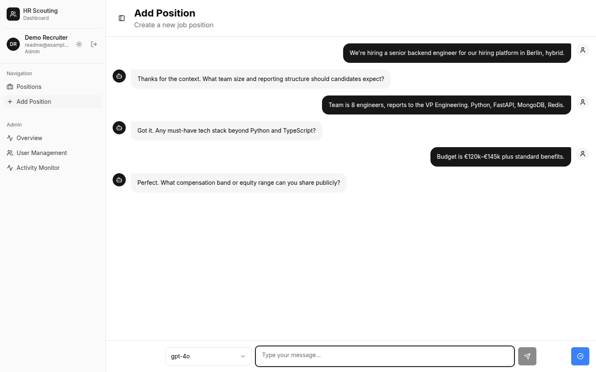
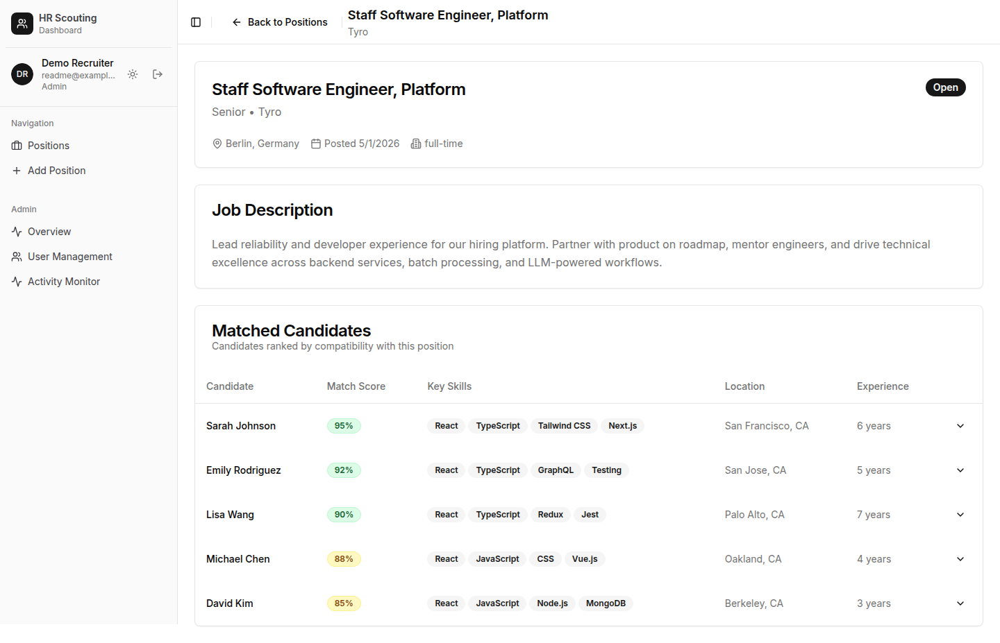
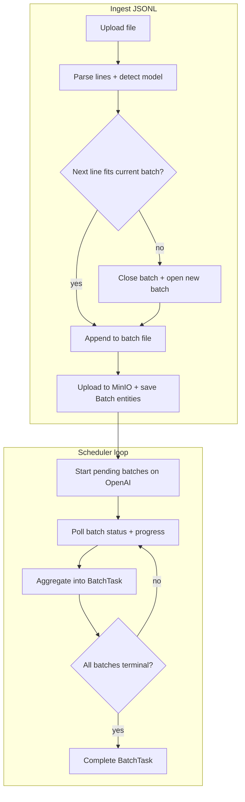

# Tyro

**HR and recruitment stack** — job positions, AI-assisted drafting, candidate matching, CV processing, and OpenAI Batch–backed workloads.

---

## Overview

This repository is a **monorepo** of independently deployable services:

| Area | Role |
|------|------|
| **`backend/`** | FastAPI API, MongoDB (Beanie), Redis, Celery workers, LLM agents for job chat/analysis (via LiteLLM). |
| **`frontend/`** | React + TypeScript + Vite + Tailwind + shadcn/ui recruiter UI. |
| **`batch_manager/`** | FastAPI service that builds, tracks, and reconciles **OpenAI Batch API** jobs (JSONL in MinIO, MongoDB metadata). |
| **`infra/`** | Shared configuration (including LiteLLM proxy config). |

The canonical way to run everything is the **root `docker-compose.yml`** (see [`CLAUDE.md`](./CLAUDE.md) for ports, env layout, and per-service commands).

---

## Screenshots

### Add position — AI chat

Guided **Add Position** flow: recruiters describe the role in natural language; an agent responds and the thread is later summarized into structured fields.

  

### Position details

Single position view with status, description, and **matched candidates** (ranking UI; data wiring evolves with the API).

  

---

## Candidate tournament model

Each [`JobPosition`](./backend/app/entity/job_position_entity.py) carries a **`JobTournament`**: a structured place to store how candidates are compared and ordered for that role.

- **Lifecycle** — `JobTournament.status` moves through `pending` → `processing` → `completed` (or `failed`), aligned with the linked background task.
- **Participants** — `TournamentCandidate` entries reference a candidate, track **`wins`** and **`rank`**, and attach optional **`reasoning`** (multilingual bullet rationales from the model).
- **Workflow** — per-candidate `TournamentCandidateStatus` values (`unchecked`, `checked`, `approved`, `hidden`, `rejected`, `interviewed`) support human review on top of automated ordering.

Conceptually, the tournament is a **comparative ranking**: candidates accumulate wins across comparison rounds; ranks consolidate that signal for the UI and downstream workflows. The same shape is reflected in the shared DTOs consumed by the frontend (`JobTournament` / `TournamentCandidate` in [`frontend/src/lib/api/types.ts`](./frontend/src/lib/api/types.ts)).

The batch service declares a dedicated **`BatchTaskType.TOURNAMENT`** (alongside CV parsing and embedding) so large-scale comparison workloads can be executed through the **OpenAI Batch API** using the same JSONL pipeline as other batch types (see below).

---

## Batch ingestion and scheduling (`batch_manager`)

High-volume LLM work is packaged as a **`BatchTask`**: one logical job that may span **multiple OpenAI `Batch` objects** when limits require splitting.

### How JSONL is batched

When a JSONL file is uploaded, [`BatchTaskCreateService`](./batch_manager/app/service/batch_task_create_service.py):

1. **Reads line by line**, parses each request, and reads the **`model`** from `body.model`.
2. **Groups work per model** into one or more rolling files (`BatchFileHandler`).
3. **Starts a new physical batch** whenever the next line would exceed:
   - **Estimated tokens** — a configurable fraction of the model’s batch **tokens per day** budget ([`MODEL_MAX_BATCH_QUEUE_LIMIT_PER_PROJECT_TPD`](./batch_manager/app/consts/rate_limits.py) × `0.2` in code),
   - **Request count** — hard cap [`MAX_REQUESTS_PER_BATCH`](./batch_manager/app/consts/rate_limits.py) (50 000),
   - **Input file size** — cap [`MAX_BATCH_INPUT_FILE_SIZE_BYTES`](./batch_manager/app/consts/rate_limits.py) (200 MB).
4. **Uploads** each batch file to **MinIO** under `{batch_task_id}/input/...`, persists entities, and hands off to the OpenAI Batch API for the appropriate **endpoint** (`/v1/responses` for chat-style tasks including tournament, `/v1/embeddings` for embeddings — see [`TypeToEndpoint`](./batch_manager/app/entity/batch_task_entity.py)).

### How work moves forward

The **`BatchSchedulerService`** runs recurring jobs (when enabled): start pending batches, **poll in-flight batches**, refresh per-batch progress, aggregate counts on the parent **`BatchTask`**, and **mark the task complete** once every child batch is in a terminal state — see the sequential **`check_batches_and_tasks_sequence`** step in [`batch_scheduler_service.py`](./batch_manager/app/service/batch_scheduler_service.py).

Artifacts (inputs, outputs, errors) stay organized under the **`batch_task_id`** prefix in the **`batch-tasks`** bucket for traceability and reprocessing.
